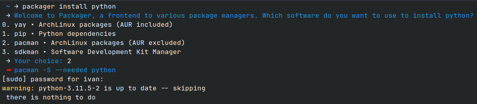

# Packager

Simple CLI to upgrade your system or install packages in a single command, no matter if you're on ArchLinux, Debian or just using Python.

Packager __always__ asks for confirmation and prints every command it executes, so you always know what is happening.

Supported:
- `apt` and `aptitude`: Debian-based distributions
- `pacman`: ArchLinux official repositories
- `yay`: ArchLinux user repository (AUR)
- `pip`: Python libraries
- `raco`: Racket libraries
- `sdkman`: Java/JVM libraries
- `yarn`: JavaScript libraries
- `npm`: Node.js libraries

Packager is made to be easy to extend: adding a backend is as simple as writing a small shell script.
We welcome contributions that add support for other package managers!

## Licensing

This project is licensed under the GNU Affero General Public License, version 3.
The full text is available in the [LICENSE.txt](LICENSE.txt) file.

## Contributing

See [CONTRIBUTING.md](CONTRIBUTING.md).
- To learn more about our coding conventions and workflow, see the [OpenSavvy Wiki](https://gitlab.com/opensavvy/wiki/-/blob/main/README.md#wiki).
- This project is based on the [OpenSavvy Playground](docs/playground/README.md), a collection of preconfigured project templates.
